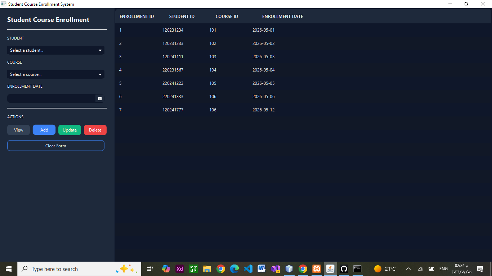

# 🎓 Student Course Enrollment System

## 📌 Overview

Student Course Enrollment System is a JavaFX desktop application designed to help manage student course enrollment records through a simple and organized graphical user interface.

The system allows users to add, update, delete, and view student enrollments while applying Object-Oriented Programming (OOP) concepts and maintaining a clean project structure.

---

## 🎯 Features

* Add new course enrollments
* Update existing enrollment details
* Delete enrollment records
* View all enrollments in a TableView
* Select student ID and course ID using ComboBox
* Choose enrollment date using DatePicker
* Prevent duplicate enrollment for the same student in the same course
* Organized graphical user interface using JavaFX
* Structured project architecture
* Database connectivity using JDBC

---

## 🛠️ Technologies Used

* Java
* JavaFX
* FXML
* CSS
* JDBC
* MySQL
* OOP Concepts
* MVC Architecture
* DAO Pattern
* NetBeans IDE
* Git & GitHub

---
## 🧱 Project Structure

```text
src/
│
├── app/
│   └── Main.java
│
├── config/
│   └── DBConnection.java
│
├── controllers/
│   └── EnrollmentController.java
│
├── dao/
│   ├── StudentDAO.java
│   ├── CourseDAO.java
│   └── EnrollmentDAO.java
│
├── models/
│   ├── Student.java
│   ├── Course.java
│   └── Enrollment.java
│
├── styles/
│   └── EnrollmentStyle.css
│
└── views/
    └── Enrollment.fxml
```

---

## 📸 Project Preview



---

## 💡 Concepts Applied

* Encapsulation
* Object-Oriented Programming
* MVC Architecture
* DAO Pattern
* Event Handling
* GUI Design
* Database Management using JDBC
* CRUD Operations
* Input Validation
* Duplicate Enrollment Prevention

---

## 🚀 How to Run

1. Clone the repository:

```bash
git clone https://github.com/ManarAbuArab/StudentCourseEnrollmentSystem.git
```

2. Open the project using NetBeans or any Java IDE.

3. Start MySQL server.

4. Create the database and required tables.

5. Add MySQL Connector/J to the project libraries.

6. Run the Main class.

---

## 👩‍💻 Author

Manar Abu Arab

---

## 🌟 Project Goal

The goal of this project is to practice building desktop applications using JavaFX while applying JDBC database connectivity, CRUD operations, GUI design, and clean software architecture principles.
